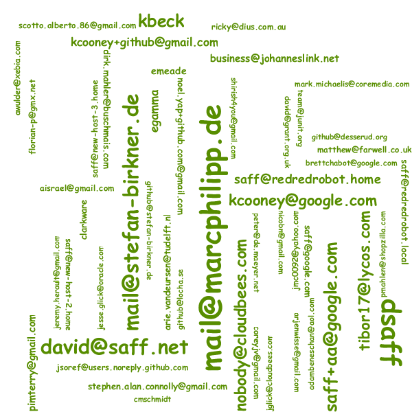

:toc:
= jQAssistant Word Cloud Report Plugin

The project provides a http://jqassistant.org/[jQAssistant] plugin for creating word clouds as reports.

Rendering is performed by https://github.com/kennycason/kumo[Kumo] - Kudos to Kenny Cason!

== Prerequisites

* Java 8 or higher
* Maven 3.5.x or higher
* jQAssistant 1.8.0 or higher (see below)

== Setup

=== Maven

The plugin can be enabled by adding it as a dependency to the jQAssistant Maven plugin.

.pom.xml
[source,xml]
----
<build>
    <plugins>
        <plugin>
            <groupId>com.buschmais.jqassistant</groupId>
            <artifactId>jqassistant-maven-plugin</artifactId>
            <version>1.8.0</version>
            <executions>
                <execution>
                    <id>default-cli</id>
                    <goals>
                        <goal>scan</goal>
                        <goal>analyze</goal>
                    </goals>
                    <configuration>
                        <scanIncludes>                                                   <!--1-->
                            <scanInclude>
                                <path>${project.basedir}/.git</path>
                            </scanInclude>
                        </scanIncludes>
                    </configuration>
                </execution>
            </executions>
            <dependencies>
                <dependency>                                                             <!--2-->
                    <groupId>org.jqassistant.contrib.plugin</groupId>
                    <artifactId>jqassistant-wordcloud-report-plugin</artifactId>
                    <version>1.8.0</version>
                </dependency>
                <dependency>                                                             <!--3-->
                    <groupId>de.kontext-e.jqassistant.plugin</groupId>
                    <artifactId>jqassistant.plugin.git</artifactId>
                    <version>1.8.0</version>
                </dependency>
            </dependencies>
        </plugin>
    </plugins>
</build>
----
<1> Configures the Git plugin to scan the local git repository.
<2> Declares the word cloud report plugin
<3> Declares the Git plugin

NOTE: The Git plugin and the scanIncludes configuration is shown to enable the example below.

=== Command Line Utility

Download the shaded JAR file from https://search.maven.org/artifact/org.jqassistant.contrib.plugin/jqassistant-wordcloud-report-plugin[Maven Central] and put it into the `/plugins` folder of the distribution.

== Reporting A Word Cloud

A word cloud can simply be created by setting the report type of a concept or constraint to `wordcloud`:

.Asciidoc
....
[[git:Authors]]
[source,cypher,role=concept,reportType="wordcloud"]
.The authors of this project as word cloud.
----
MATCH
  (author:Author)-[:COMMITTED]->(:Commit)
RETURN
  author.email
----
....

[source,xml]
.XML
----
<concept id="git:Authors">
    <description>The authors of this project as word cloud.</description>
    <cypher><![CDATA[
        MATCH
          (author:Author)-[:COMMITTED]->(:Commit)
        RETURN
          author.email
    ]]></cypher>
    <report type="wordcloud"/>
</concept>
----

Every value returned by the result will be converted to a value in the word cloud (example from JUnit4):

[[feedback]]
== Feedback

Please report any issues https://github.com/jqassistant-contrib/jqassistant-wordcloud-report-plugin/issues[here].

== Acknowledgements

The plugin could not provide its functionality without the support of the following open source projects:

* https://github.com/kennycason/kumo[Kumo]
* https://jqassistant.org[jQAssistant]
* https://github.com/kontext-e/jqassistant-plugins[Git Plugin for jQAssistant]
* https://neo4j.org[Neo4j]
